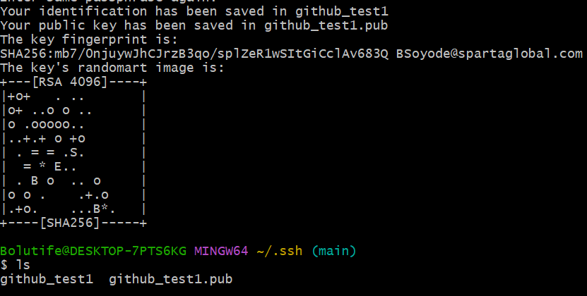
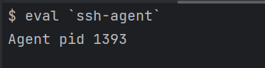

## What is SSH? What is it used for? ##
SSH stands for Secure Shell. It is a cryptographic network protocol that provides a secure way to access and manage remote machines over an unsecured network. 

SSH is widely used for secure remote administration, file transfers, and secure tunneling of other network services.
Here are some key features and uses of SSH:

1. Secure Remote Access: SSH allows users to securely log into a remote machine or server over an unsecured network, such as the internet. It provides strong encryption and authentication mechanisms to protect the confidentiality and integrity of the communication.

2. Secure File Transfer: SSH includes a secure file transfer protocol (SFTP) that enables secure file transfers between computers. It provides a more secure alternative to traditional FTP by encrypting the data and protecting it from unauthorized access.

3. Secure Remote Command Execution: SSH allows users to execute commands on a remote machine securely. This is particularly useful for remote administration and managing servers or network devices.

4. Port Forwarding and Tunneling: SSH can create secure tunnels between local and remote machines, allowing secure access to services running on remote machines. This feature is commonly used to securely access services like databases, web servers, or other network services.

Overall, SSH provides a secure and encrypted way to remotely access and manage systems, ensuring the confidentiality and integrity of the communication.
## How does SSH work? What are Private and Public keys?

SSH works using a combination of symmetric and asymmetric encryption, along with key-based authentication. Here's a simplified explanation of how SSH works:
1. Key Generation: The first step is to generate a key pair consisting of a private key and a public key. The private key is kept secret and should never be shared, while the public key can be freely shared.
2. Client-Server Connection: When a client wants to establish an SSH connection with a server, it initiates a connection request.

3. Server Identification: The server sends its public key to the client as part of the connection process. This allows the client to verify the server's identity and authenticity.
4. Key Exchange: The client and server perform a key exchange process to agree on a shared secret key that will be used for symmetric encryption during the session

- Private Key: The private (stored in local computer) is a secret key that should be kept securely and not shared with anyone. It is used for decrypting messages encrypted with the corresponding public key. The private key is used for authentication during the SSH connection process.
- Public Key: The public key (stored in server) is derived from the private key and can be freely shared with others. It is used by other parties to encrypt messages 
### Why use SSH? How does it increase security? ###
#### The receiver has the correct cipher to decrypt the message. ####
#### encryption is scrambling data while it is in transit.#### 
SSH (Secure Shell) is a network protocol that provides secure remote access to systems over an unsecured network. It is widely used for secure remote administration and file transfer.

Here are some reasons why SSH is used and how it increases security:

1. Encryption: SSH encrypts all data transmitted between the client and server, including passwords, commands, and file transfers. This prevents eavesdropping and protects sensitive information from being intercepted.

2. Authentication: SSH uses various authentication methods, such as passwords, public key cryptography, and two-factor authentication (2FA). These methods ensure that only authorized users can access the system, reducing the risk of unauthorized access.

3. Secure Remote Access: SSH allows users to securely access remote systems over an untrusted network, such as the internet. By using strong encryption and authentication mechanisms, SSH ensures that the remote access session remains secure and protected from malicious actors.

4. Port Forwarding: SSH supports port forwarding, which allows secure tunneling of network connections through an SSH server. This feature enables users to access services securely, even if those services are not directly exposed to the internet. It can also help bypass network restrictions or firewalls.

5. Secure File Transfer: SSH provides secure file transfer capabilities using protocols like SFTP (SSH File Transfer Protocol) and SCP (Secure 

## How can you create an SSH key pair? ##

1. Open a terminal or command prompt on your local machine.

2. Use the `ssh-keygen` command to generate the key pair. By default, this command creates a 2048-bit RSA key pair. You can specify a different key type or key size if desired. For example, to generate an RSA key pair with a key size of 4096 bits, you can use the following command:

3. Next, the command will prompt you to enter a passphrase for the key pair. The passphrase adds an extra layer of security by encrypting the private key with a password. You can choose to enter a passphrase or leave it blank for no passphrase. However, it is generally recommended to use a passphrase for added security.

4. Once you provide the passphrase (or leave it blank), the command will generate the key pair and display a message indicating the location of the public and private keys. By default, the public key will have a `.pub` extension and will be located in the same directory as the private key.

5. Congratulations! You have successfully generated an SSH key pair. The private key (`id_rsa`) should be kept secure and never shared. The public key (`id_rsa.pub`) can be shared with remote servers or services that you want to authenticate with using SSH.

You can now use the generated SSH key pair for authentication when connecting to remote systems or services that support SSH-based authentication.

##### SSH keys are useful for automation. #####
###### Note: SSH uses keys( public). Public key is our lock and private key is the key that opens the lock (SSH) 
 

#### Steps in generating public and private keys
 - $ ssh-keygen -t rsa -b 4096 -C "BSoyode@spartaglobal.com"
Generating public/private rsa key pair. The gen part is generate. -t allows you to select a specific type of encryption for your keys. In this case, it is rsa. 
 -b 4096(tells you the bit length; how long you want it). -C is for comments(we added the email address in it). This was done using Gitbash (under administrator). 

- Enter the file name in which to save the key( example: github_1)

- Enter passphrase: press enter without having a passphrase. 
 Result
-  Then do a $ls to list the files present. 

- To generate the private key, use $ cat github_test1.pub

- Copy the key to github under the new SSH key under your settings.

The result is shown below: 
- 
- 
- Open Pycharm and continue: use $ cd python, 
then $ git status then $ eval `ssh-agent`(it provides information on the ssh key to use)

- 
- Agent pid 1200. pid stands for process ID

- On GitBash try: $ ssh-add ~/.ssh/github_test1

- - `ssh-add`: This is the command to add an SSH private key to the SSH agent.

- `~/.ssh/github_test1`: This is the path to the SSH private key file (`github_test1`) located in the `.ssh` directory within the user's home directory (`~`).
- Next step is $ ssh -T git@github.com

- The command `ssh -T git@github.com` is used to test the SSH connection to the GitHub server. It verifies if your SSH key is properly set up and authenticated with your GitHub account. Here's what the command does:
Description: 

- `ssh`: This is the command-line tool for establishing SSH connections.
- `-T`: This option is used to indicate that the SSH connection should be used for remote command execution rather than interactive shell access.
- `git@github.com`: This is the SSH endpoint for the GitHub server. It specifies the user (`git`) and the hostname (`github.com`) to connect to.
What does it mean by Github does not provide shell access?
- Yes, you can connect to Github but ur not allowed to interact with shell. 

- Go to github, then code under repository, then SSH. On gitbash type:
- $ git remote set-url origin git@github.com:Boluti/Tech254_python.git

- Next is $ git status, then $ git add. which adds to staging. 

#### Description:
The command `git remote set-url origin git@github.com:Boluti/Tech254_python.git` is used to update the URL of the remote repository named "origin" in your local Git repository. Here's what each part of the command means:

- `git remote set-url origin`: This is the command to update the URL of the remote repository named "origin".
- `git@github.com:Boluti/Tech254_python.git`: This is the new SSH URL for the remote repository. It follows the format `git@github.com:/.git`, where `` is your GitHub username and `` is the name of the repository.

When you run this command, it updates the URL of the remote repository named "origin" in your local Git repository to the specified SSH URL. This allows you to push and pull changes to and from the GitHub repository using the SSH protocol.

#### To continue:
- $ git commit -m "Small change for testing"
- $ git status 

- $ git push -u origin main

- To find the origin of git or github, use
$ git remote -v

#### Things to remember: 
- $pwd: opens in your own directory
- $ cd: takes you to your own directory. 
- $ ls: shows all the files and folders
- $ls -a : shows all the hidden folders
- $ssh: storage place for ssh keys. ssh key needs to be hidden because of security. 
- $ mkdir .ssh: it makes a new directory called ssh.  After creating the folder, use $ls -a to view hidden folders. 
To remove a directory after creating one, use: 
- $ rm -rf. ssh : used to force delete something
- $cd . ssh is used to go into a (.ssh) folder in a directory
